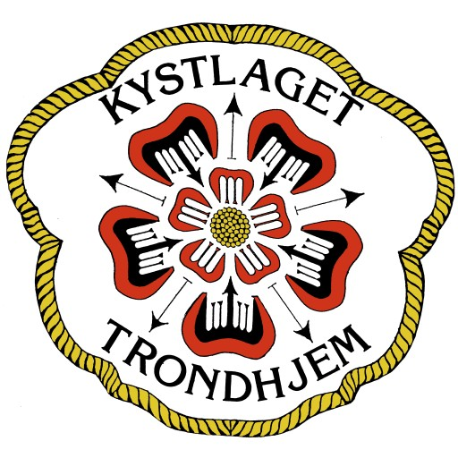

<div id="top"></div>

<div align="center">
  <a href="https://www.kystlaget-trh.no/">
    
  </a>

  <br />
  <h1 align="center">Elfryd Sensor Monitoring System</h1>
  

  <p align="center">
    A comprehensive IoT solution for monitoring battery levels and environmental conditions on the Elfryd boat, featuring secure data collection, cloud storage, and real-time monitoring capabilities.
  </p>
</div>

<hr />
<br />
<div align="center">
  <a href="https://en.wikipedia.org/wiki/C_(programming_language)"></a>
  <a href="https://www.python.org/"></a>
  <a href="https://www.docker.com/"></a>
  <a href="https://docs.microsoft.com/en-us/dotnet/csharp/"></a>
  <a href="https://dotnet.microsoft.com/"></a>
  <br>
  <a href="https://mqtt.org/"></a>
  <a href="https://azure.microsoft.com/"></a>
  <a href="https://vuejs.org/"></a>
  <a href="https://nuxtjs.org/"></a>
</div>

<br />

<details>
  <summary>Table of Contents</summary>
  <ol>
    <li><a href="#system-overview">System Overview</a></li>
    <li>
      <a href="#project-components">Project Components</a>
      <ul>
        <li><a href="#1-sensor-layer">Sensor Layer</a></li>
        <li><a href="#2-ble-communication-layer">BLE Communication Layer</a></li>
        <li><a href="#3-nrf9160-feather-hub">nRF9160 Feather Hub</a></li>
        <li><a href="#4-mqtt-broker-system">MQTT Broker System</a></li>
        <li><a href="#5-backend--frontend-coming-soon">Backend & Frontend</a></li>
      </ul>
    </li>
    <li><a href="#data-flow">Data Flow</a></li>
    <li><a href="#key-features">Key Features</a></li>
    <li><a href="#getting-started">Getting Started</a></li>
    <li><a href="#project-status">Project Status</a></li>
    <li><a href="#development-team">Development Team</a></li>
  </ol>
</details>

<!-- # Elfryd Boat Monitoring System -->

<!--  -->

<!-- A comprehensive IoT solution for monitoring battery levels and environmental conditions on the Elfryd boat, featuring secure data collection, cloud storage, and real-time monitoring capabilities. -->

## System Overview

The Elfryd Boat Monitoring System provides a complete data pipeline from onboard sensors to a user-friendly dashboard:

```
Sensors → BLE Network → nRF9160 Hub → MQTT Broker → Database → Backend → Frontend
```

This IoT system enables members of Kystlaget to:

- Monitor battery voltage levels across multiple batteries
- Track environmental conditions (temperature, motion)
- View historical data and trends
- Configure monitoring parameters remotely

## Project Components

### 1. Sensor Layer

Collects data from physical sensors on the boat, including:

- Battery voltage sensors
- Temperature sensors
- Gyroscope/accelerometer for motion detection

[Sensor Documentation →](/battery-sensor/sensor/README.md)

### 2. BLE Communication Layer

Enables energy-efficient local communication between sensors through Bluetooth Low Energy:

- **BLE Peripheral**: Sensor nodes that collect and transmit data
- **BLE Central**: Central node that processes incoming data from peripherals and forwards it to the nRF9160 Feather Hub

[BLE Central Documentation →](/battery-sensor/nrf/ble/central/README.md)
[BLE Peripheral Documentation →](/battery-sensor/nrf/ble/peripheral/README.md)

### 3. nRF9160 Feather Hub

The central communication hub that:

- Receives sensor data from the BLE Central node
- Timestamps and processes sensor readings
- Provides LTE connectivity for cloud transmission over MQTT
- Is configurable remotely via MQTT
- Caches data to reduce network load
- Uses TLS for secure communication

[Hub Documentation →](/battery-sensor/nrf/hub/README.md)
[Flashing Instructions →](/battery-sensor/nrf/hub/docs/FLASHING.md)

### 4. MQTT Broker System

Azure VM-based message broker system that:

- Secures communications with TLS encryption
- Processes and stores incoming sensor data
- Provides a REST API for data access
- Enables configuration commands to be sent to the boat

[Broker Documentation →](/battery-sensor/broker/README.md)
[API Documentation →](/battery-sensor/broker/docs/api.md)
[Bridge Documentation →](/battery-sensor/broker/docs/bridge.md)

### 5. Backend & Frontend (Coming Soon)

The user interface components (in development):

- **.NET Backend**: Processes and analyzes sensor data
- **Nuxt (Vue.js) Frontend**: Provides an intuitive dashboard for monitoring

*Note: These components are currently being developed and will be added to the project soon.*

## Data Flow

1. **Data Collection**: Sensors measure battery voltage, temperature, and motion
2. **BLE Transmission**: BLE Central node receives individual readings from sensor nodes
3. **MQTT Transmission**: nRF9160 Hub sends sensor data to the MQTT broker via LTE at regular intervals
4. **Data Storage**: TimescaleDB stores time-series data efficiently
5. **Data Access**: REST API provides standardized data access for the backend
6. **Backend Processing**: Backend processes data for analysis and visualization
7. **Visualization**: Frontend dashboard displays real-time and historical data

## Key Features

- **Robust Connectivity**: Cellular LTE connection ensures data transmission from remote locations
- **Power Efficiency**: BLE communication and optimized sampling intervals preserve power
- **Data Buffering**: Continuous data collection even during network outages
- **Secure Communication**: End-to-end encryption using TLS for all data transmission
- **Configurable Parameters**: Remotely adjust sampling rates and request data between intervals
- **Time-Series Database**: Optimized storage and retrieval of sensor data

## Getting Started

For detailed setup instructions, visit the specific component documentation linked above. Each component includes its own setup guides, prerequisites, and configuration options.

### Quick Start Guides:

- [Setting up the Feather Hub](/battery-sensor/nrf/hub/docs/FLASHING.md)
- [VM Setup for Broker](/battery-sensor/broker/docs/vm_setup.md)

## Project Status

- ✅ Sensor Components
- ✅ BLE Communication
- 🔄 I2C transmission - In Progress
- ✅ nRF9160 Hub
- ✅ MQTT Broker & Database
- 🔄 Backend (.NET) - In Progress
- 🔄 Frontend (Nuxt/Vue.js) - In Progress

## Development Team

This project is developed as part of IT2901 Information Technology Project II at NTNU. Our team is focused on creating a reliable IoT monitoring solution for the Elfryd boat.

<p align="right">(<a href="#top">back to top</a>)</p>