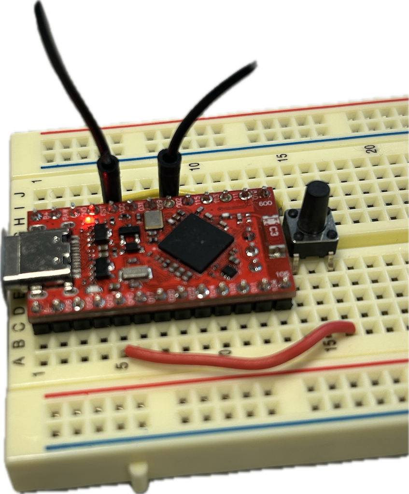

# Elfryd BLE Peripheral

A Zephyr-based peripheral for the Promicro nRF52840 board that monitors battery voltage, temperature, and motion data and advertises it over Bluetooth Low Energy (BLE).

## Overview

This peripheral firmware is part of the Elfryd boat monitoring system's BLE communication layer. It runs on the Promicro nRF52840 board and collects data from connected sensors, exposing the readings via standard BLE GATT services to be consumed by the BLE Central.

## Features

- **Battery Voltage Monitoring**: Reads voltage through ADC with configurable gain
- **Temperature Sensing**: Interfaces with BME280 sensor via I2C
- **Motion Detection**: Reads accelerometer and gyroscope data from MPU6050 via I2C
- **BLE Advertising**: Continuously advertises for connection
- **Status LED**: Visual indication of connection status
- **Configurable Sensor ID**: Unique identifier for each sensor node

## Hardware Setup

### Supported Sensors

- **ADC Voltage Input**: Connected to AIN0 (P0.02) for battery readings
- **BME280**: Temperature sensor connected via I2C0
- **MPU6050**: 6-axis motion sensor connected via I2C1

### Wiring

#### Voltage Measurement

The voltage is measured through a voltage divider to bring higher voltages into the ADC's range:

1. Connect your voltage source to a voltage divider
2. Connect the output of the voltage divider to pin P0.02 (AIN0)
3. Make sure the divided voltage doesn't exceed 3.3V



#### I2C Sensors

For BME280 temperature sensor:
- Connect SCL to the Promicro's I2C0 SCL pin
- Connect SDA to the Promicro's I2C0 SDA pin
- Connect VCC to 3.3V and GND to ground

For MPU6050 gyroscope/accelerometer:
- Connect SCL to the Promicro's I2C1 SCL pin
- Connect SDA to the Promicro's I2C1 SDA pin
- Connect VCC to 3.3V and GND to ground
- Connect the INT pin to P0.11 (optional, for interrupt-driven operation)

## Building and Flashing

### Prerequisites

- Zephyr SDK
- nRF Connect SDK
- West build tools

### Building

Navigate to your Zephyr installation directory and run:

```bash
cd ~/zephyrproject/zephyr
west build -b promicro_nrf52840/nrf52840/uf2 path/to/IT2901-25-elfryd/battery-sensor/nrf/promicro_nrf52840/peripheral
```

### Flashing

After building, you can flash using either of these methods:

#### Method 1: Using West

```bash
west flash
```

#### Method 2: Manual UF2 Flashing

1. Put the Promicro board into bootloader mode by double-pressing the reset button
2. A drive named "PROBOOT" should appear
3. Copy the file `build/zephyr/zephyr.uf2` to this drive
4. The board will automatically reset and run the new firmware

## Configuration Options

### Main Configuration (prj.conf)

The peripheral behavior can be configured by editing the `prj.conf` file:

```
CONFIG_BT_DEVICE_NAME="Kystlaget Sensor"  # Change the Bluetooth device name
CONFIG_BT_SMP=n                          # Disable pairing for simplified setup
CONFIG_ADC=y                             # Enable ADC for voltage readings
CONFIG_SENSOR=y                          # Enable sensor drivers
CONFIG_BME280=y                          # Enable BME280 temperature sensor
CONFIG_MPU6050_TRIGGER_NONE=y            # Configure MPU6050 without interrupts
CONFIG_CBPRINTF_FP_SUPPORT=y             # Enable floating point support
```

### Device Tree Overlays

The hardware configuration is defined in the device tree overlay file:

- `boards/promicro_nrf52840_nrf52840_uf2.overlay`: Configures ADC settings, BME280 and MPU6050 sensors

### Sensor Configuration

To enable or disable specific sensors, modify the following definitions in `src/main.c`:

```c
#define BAUT_VOLTAGE       // Enable voltage measurements
#define BAUT_TEMPERATURE   // Enable temperature sensor
#define BAUT_MPU           // Enable gyroscope/accelerometer
```

## BLE Services

The peripheral exposes the following GATT services:

### Sensor ID Service (UUID: 0x2c05)
- **ID Characteristic**: Provides a unique ID for the sensor node

### Voltage Service (UUID: 0x2B18)
- **Voltage Characteristic**: Provides the current voltage reading in millivolts (calibrated for voltage divider)

### Temperature Service (Standard UUID)
- **Temperature Characteristic**: Provides the current temperature in Celsius

### MPU6050 Service (UUID: 0x2f01)
- **MPU Characteristic**: Provides accelerometer and gyroscope readings as packed 24-bit signed integers

## Troubleshooting

### Common Issues

1. **LED not blinking**: Ensure the firmware is correctly flashed and the LED is properly connected
2. **No advertising**: Check that Bluetooth is enabled and properly initialized
3. **No sensor readings**: Verify sensor wiring and I2C connections
4. **Incorrect voltage readings**: Check voltage divider calculations and adjust the calibration factor in the code

### Debugging

The firmware includes extensive debug prints via the serial console. Connect to the board's serial port (typically at 115200 baud) to view diagnostic messages.

## Based On

This project is based on the Zephyr `samples/bluetooth/peripheral_hr` sample.