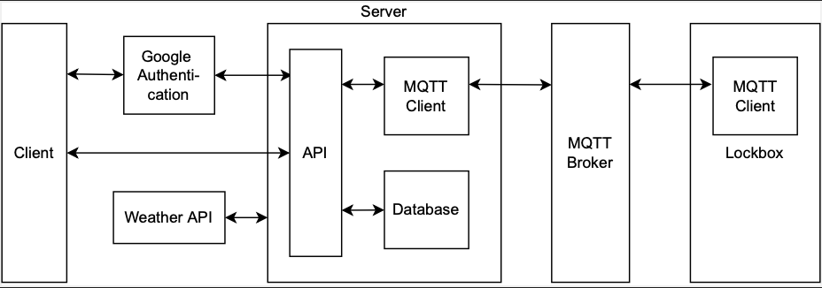

<div id="top"></div>

[![C#][c#-shield]][c#-url]
[![C][c-shield]][c-url]
[![Typescript][typescript-shield]][typescript-url]
[![.NET][net-shield]][net-url]
[![React][react-shield]][react-url]
[![Azure][azure-shield]][azure-url]

<!-- PROJECT LOGO -->
<br />
<div align="center">
  <a href="https://www.kystlaget-trh.no/">
    
  </a>

<h3 align="center">Digital LockBox</h3>

  <p align="center">
    This project gives the possibility to control a lockbox by booking a boat through a booking system. The project were developed for Kystlaget.
    <br />
    <a href="https://bachelor-fork.vercel.app/"><strong>View deployed version »</strong></a>
    <br />
  </p>
</div>

<!-- TABLE OF CONTENTS -->
<details>
  <summary>Table of Contents</summary>
  <ol>
    <li>
      <a href="#about-the-project">About The Project</a>
      <ul>
        <li><a href="#built-with">Built With</a></li>
      </ul>
    </li>
    <li>
      <a href="#getting-started">Getting Started</a>
      <ul>
        <li><a href="#prerequisites">Prerequisites</a></li>
        <li><a href="#installation">Installation</a></li>
        <li><a href="#run-the-client-and-server-locally">Running</a></li>
      </ul>
    </li>
    <li><a href="#deployment">Deployment</a></li>
    <li><a href="#project-structure">Project structure</a></li>
    <li><a href="#developers">Developers</a></li>
  </ol>
</details>

<!-- ABOUT THE PROJECT -->

## About The Project

[![Product Name Screen Shot][product-screenshot]](https://kystlaget.vercel.app)

Kystlaget in Trondheim has a boat named Elfryd that their members can borrow. The key to the boat is available to every member, and the boat can be booked by setting your name up on a calendar. This system is popular among the members of Kystlaget, and the boat is getting rented and booked out frequently. With the current system, accessing the boat can often times be troublesome. Members sometimes forget to return the key on time, which causes the system to collapse, as the next member won't find the key in its designated area. This means that administrators volunteering for Kystlaget have to spend time and energy tracking down the location of the key. Another problem is that any member who knows the code can access the key at any time, while Kystlaget would want to limit the access to members that have booked the boat at a certain time.

To solve this problem, the group was given the task of using the nRF91 SoC by Nordic Semiconductor to control a locking mechanism on a deposit box remotely. A client/server application should receive requests from users to unlock the box at specific times, and could potentially also notify a user that the key needs to be returned if time is running out. The time slots should be able to be booked by members in advance. The goal was to make it easier for members of Kystlaget to borrow the boat, and easier for managers to manage the use of the boat.

<p align="right">(<a href="#top">back to top</a>)</p>

### Built With

-   [Next.js](https://nextjs.org/)
-   [React.js](https://reactjs.org/)
-   [ASP.NET Core](https://docs.microsoft.com/en-us/aspnet/core/?view=aspnetcore-6.0)

<p align="right">(<a href="#top">back to top</a>)</p>

<!-- GETTING STARTED -->

## Getting Started

Here you can get information about how to run the application locally.

### Prerequisites

There is some technologies that you need before you can run the application, here you will get a list of information on what you need to run the application.

-   node: [Install Node.js](https://nodejs.org/en/download/)
-   .NET: [Install .NET](https://dotnet.microsoft.com/en-us/download/dotnet/5.0)

### Installation

1. Clone the repo
    ```sh
    git clone https://github.com/j-enk/it2901_23_nRF91-DepositBox.git
    ```
2. Install packages
    ```sh
    cd server/frontend && yarn install
    ```
3. Install dotnet packages

```sh
cd server/backend/backend.API && dotnet restore
```

4. Install EFCore globally

```sh
dotnet tool install --global dotnet-ef
```

### Run the client and server locally

**Server:**

1. Go to directory

```sh
cd server/backend/backend.API
```

2. Open `AppDbInitializer.cs` in the `Data` folder, and add a user with your Google account e-mail. This can be done as shown on lines 29 - 36. If you've removed or updated the users with e-mails on lines 210 and 211, remember to update the e-mails here aswell or the migrations won't run properly.

3. Migrate database

```sh
dotnet ef database update --context LockBoxContext
```

If this fails check that there is a `Migrations` folder in `Backend.API`. If not, run 
```sh
dotnet ef migrations add InitialCreate --context LockBoxContext
```
then run the above command again. If you're still having problems, delete `Migrations` then run add migrations and database update again in this order.

4. Start server

```sh
dotnet watch run
```

Server is now running at [https://localhost:5001/](https://localhost:5001/).

**Client:**

1. Go to directory

```sh
cd server/frontend
```
2. Install packages

```sh
yarn install
```

3. Start application

```sh
yarn dev
```

Client is now running at [http://localhost:3000](http://localhost:3000)

<p align="right">(<a href="#top">back to top</a>)</p>

## Deployment

When deploying the application, you need to make sure both frontend and backend are withing the same domain. This is because the frontend uses cookies to store the JWT token, and the backend needs to be able to access the cookie. If the frontend and backend is not within the same domain, the cookie will not be accessible by the backend on most browsers.
### Frontend

We recommend using [Vercel](https://vercel.com/) to deploy the frontend. Next.js is created by vercel, which makes the deployment seamless. However you can use any other _static hosting_ service like azure to deploy the frontend.

The frontend has 4 environment variables that needs to be set in the deployment environment.

```sh	
API_URL_DEV: "https://localhost:5001/api/"
API_URL_PROD: (api url to production server, example: "https://apiserver.no/api/")
COOKIE_DOMAIN_DEV: "localhost"
COOKIE_DOMAIN_PROD: (domain name of production server, example: ".cookiedomain.no")
```

### Backend

We recommend using [Azure](https://azure.microsoft.com/en-us/) App Service to deploy the backend. Here you can easily set up a CD pipeline and deploy the backend from github. 

To use custom domains with HTTPS on Azure App Service, you need to scale the application to at least the Basic tier.

### MQTT
Check out the [MQTT](/nrf/README.md) documentation for more information about the MQTT Broker and Client.


<p align="right">(<a href="#top">back to top</a>)</p>

## Project structure

This section is for the project structure. The respective documentation for every section is in the respective folder.



### [nrf9160](./nrf)

    nrf
    ├─────── mqtt_simple

### [client](./server/frontend/)

    server
    ├─────── frontend

### [server](./server/backend/backend.API/)

    server
    ├─────── backend
    |        ├── backend.API

<p align="right">(<a href="#top">back to top</a>)</p>

<!-- CONTACT -->

## Developers

Ingeborg Hirsti

Hanna Meland Vestvik

Sondre Aune Stokke

Sebastian Hegreberg

Martin Skatvedt

Haavard Brummenæs

<p align="right">(<a href="#top">back to top</a>)</p>

<!-- MARKDOWN LINKS & IMAGES -->
<!-- https://www.markdownguide.org/basic-syntax/#reference-style-links -->

[c#-shield]: https://img.shields.io/badge/C%23-239120?style=for-the-badge&logo=c-sharp&logoColor=white
[c#-url]: https://docs.microsoft.com/en-us/dotnet/csharp/
[c-shield]: https://img.shields.io/badge/C-00599C?style=for-the-badge&logo=c&logoColor=white
[c-url]: https://en.wikipedia.org/wiki/C_programming_language
[typescript-shield]: https://img.shields.io/badge/TypeScript-007ACC?style=for-the-badge&logo=typescript&logoColor=white
[typescript-url]: https://www.typescriptlang.org
[react-shield]: https://img.shields.io/badge/React-20232A?style=for-the-badge&logo=react&logoColor=61DAFB
[react-url]: https://reactjs.org/
[net-shield]: https://img.shields.io/badge/.NET-5C2D91?style=for-the-badge&logo=.net&logoColor=white
[net-url]: https://dotnet.microsoft.com/en-us/
[azure-shield]: https://img.shields.io/badge/Azure_DevOps-0078D7?style=for-the-badge&logo=azure-devops&logoColor=white
[azure-url]: https://azure.microsoft.com/nb-no/
[postgresql-shield]: https://img.shields.io/badge/PostgreSQL-316192?style=for-the-badge&logo=postgresql&logoColor=white
[postgresql-url]: https://www.postgresql.org/
[product-screenshot]: images/frontpage.png
